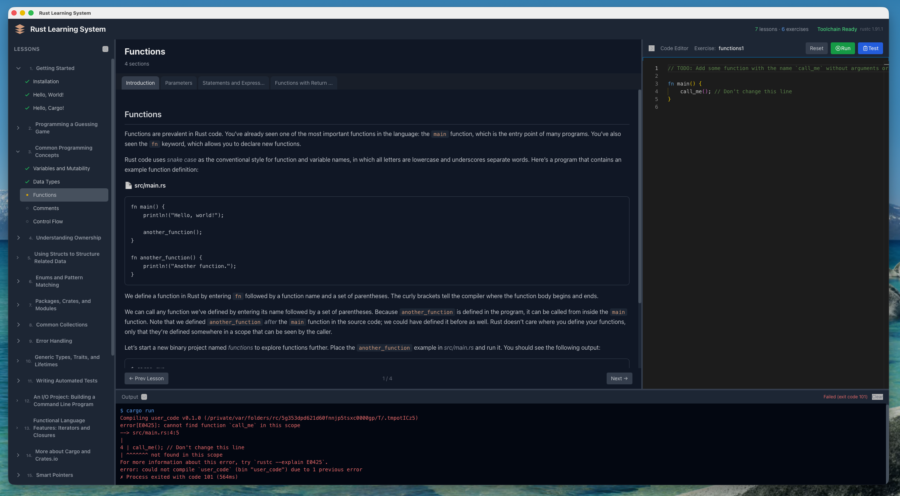

# Rust language learning system

I built this to help learning Rust language based on [the book](https://github.com/rust-lang/book) and [rustlings](https://github.com/rust-lang/rustlings).



The application tracks progress per chapter and divides content into micro-lessons based on book sections. Each micro-lesson includes matched hands-on exercises from Rustlings that compile and run directly in the application to show results immediately.

## Running the Application

### Download Pre-built Binary

Download the latest release from [GitHub Releases](https://github.com/nicechester/rust-learning-system/releases).

### Requirements

To run this application, you need:

- Rust and Cargo (required for hands-on exercises)
- macOS: No additional dependencies
- Linux: webkit2gtk
- Windows: WebView2 (pre-installed on Windows 10/11)

Install Rust:

```bash
curl --proto '=https' --tlsv1.2 -sSf https://sh.rustup.rs | sh
source $HOME/.cargo/env
```

Linux webkit2gtk installation:

```bash
sudo apt install libwebkit2gtk-4.0-37
```

## Building from Source

To build from source, you additionally need:

- Node.js (version 18 or higher)
- npm (comes with Node.js)
- System dependencies:
  - macOS: Xcode Command Line Tools
  - Linux: libwebkit2gtk-4.0-dev, build-essential, libssl-dev, libgtk-3-dev, libayatana-appindicator3-dev, librsvg2-dev
  - Windows: Microsoft Visual Studio C++ Build Tools

Verify installation:

```bash
node --version
npm --version
rustc --version
cargo --version
```

## Installation

### 1. Install Rust

If Rust is not installed, install it using rustup:

```bash
curl --proto '=https' --tlsv1.2 -sSf https://sh.rustup.rs | sh
```

After installation, restart your terminal or run:

```bash
source $HOME/.cargo/env
```

### 2. Install System Dependencies

For macOS:

```bash
xcode-select --install
```

For Ubuntu/Debian:

```bash
sudo apt update
sudo apt install libwebkit2gtk-4.0-dev build-essential curl wget file libssl-dev libgtk-3-dev libayatana-appindicator3-dev librsvg2-dev
```

For Fedora:

```bash
sudo dnf install webkit2gtk4.0-devel openssl-devel curl wget file gcc-c++ gtk3-devel libappindicator-gtk3-devel librsvg2-devel
```

For Windows, download and install:
- Microsoft Visual Studio C++ Build Tools
- WebView2 (usually pre-installed on Windows 10/11)

### 3. Clone and Install Dependencies

```bash
cd app
npm install
```

## Usage

### Development Mode

Run the application in development mode with hot-reload:

```bash
npm run dev
```

This starts the Vite development server and launches the Tauri application.

### Build for Production

Create an optimized production build:

```bash
npm run tauri:build
```

The compiled application will be available in the `src-tauri/target/release` directory.

### Other Commands

- Build frontend only: `npm run build`
- Preview production build: `npm run preview`
- Run Tauri CLI directly: `npm run tauri [command]`
- Clean build artifacts and dependencies: `npm run clean:all`

## Recommended IDE Setup

- [VS Code](https://code.visualstudio.com/) + [Tauri](https://marketplace.visualstudio.com/items?itemName=tauri-apps.tauri-vscode) + [rust-analyzer](https://marketplace.visualstudio.com/items?itemName=rust-lang.rust-analyzer)

## Dependencies

- @tauri-apps/api: Tauri JavaScript API
- @tauri-apps/plugin-sql: SQL database plugin
- marked: Markdown parser
- monaco-editor: Code editor component

## Content Sources

This application uses content from the following open source projects:

- [The Rust Programming Language Book](https://github.com/rust-lang/book)
- [Rustlings](https://github.com/rust-lang/rustlings)

## Troubleshooting

If you encounter build errors:

1. Ensure all prerequisites are correctly installed
2. Update Rust: `rustup update`
3. Clear node modules and reinstall: `npm run clean:all && npm install`
4. Check Tauri documentation for platform-specific issues: https://tauri.app/v1/guides/getting-started/prerequisites

## 📄 License

This project is licensed under the MIT License - see the [LICENSE](LICENSE) file for details.